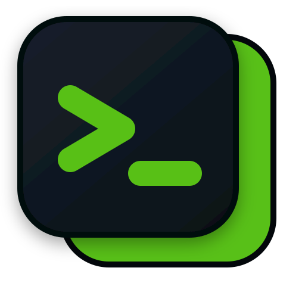
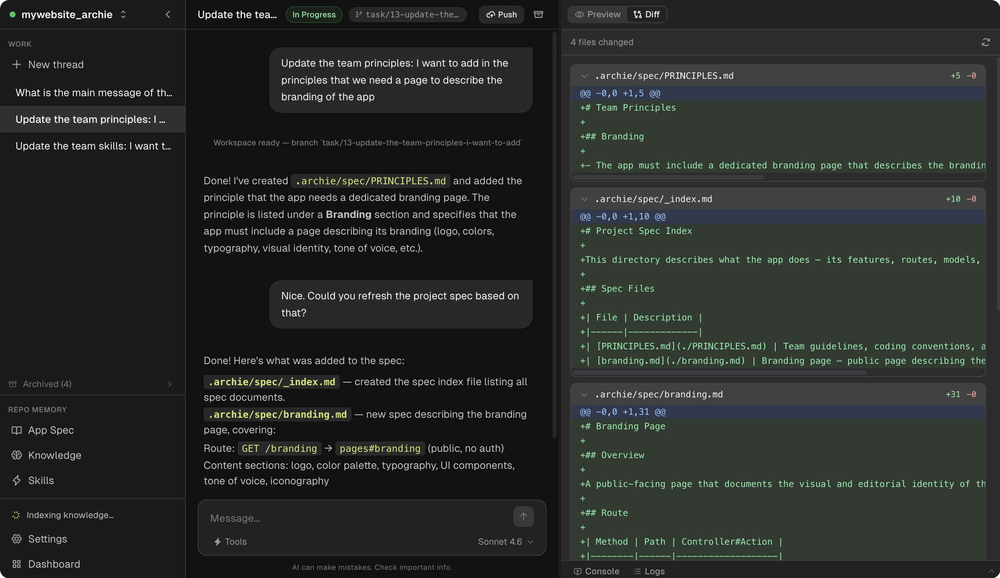

<p align="center">
  
  <br />
  <h1 align="center">Archie</h1>
  <p align="center">
    
    = 20" />
    
  </p>
</p>

**Deploy your own AI development environment. Access it from anywhere.**

Every few months there is a new AI coding tool. You migrate your workflow, learn the new UI, hit a wall on something it does not support yet, and wait for the next release. Your actual development environment the repos, the previews, the team conventions gets scattered across whatever tool you happen to be using this quarter.

Archie is a different bet: an open-source, self-hosted AI development environment you deploy to your own server and access through the browser. It brings your repos, isolated worktrees, live previews, coding agents, and project context into one place while still letting you use Claude Code, Codex, or whatever provider CLI you prefer.

Run it on a remote box you control or on your laptop. Either way, the environment is yours.

<p align="center">
  
</p>

## Why Archie

Most AI coding tools compete on chat UX or model access. Archie is different: it gives those tools a persistent environment to work inside.

- **Deploy it once, use it from anywhere**: run Archie on a server you control and open the same workspace from any machine
- **Keep parallel work isolated**: each task gets its own git worktree and branch so agents do not step on each other
- **See the app while the agent works**: live previews and console output are part of the same environment
- **Capture team context in the workspace**: skills and the codebase index stay attached to the repo instead of disappearing into chat history
- **Stay provider-agnostic**: Claude Code, Codex, and other CLIs plug into Archie instead of locking you into one hosted product
- **You own it**: your repos, previews, prompts, and workflows live in a system you control, not behind someone else's login. If something is missing, build it, automate it, or customize it yourself

Archie is not trying to replace Claude Code, Codex, or any hosted AI coding app. Those tools are good at what they do. Archie gives you a stable, browser-accessible home around them, a place where your workflows, your team's rules, and your project context persist regardless of which provider or agent you plug in.

## How It Works

You describe a task in a conversation thread. Archie reads your project context, then the agent works in an isolated git worktree with isolated DB. A dedicated branch where changes stay contained. A live preview and console start for that task so you see results in real time. When the work is ready, you review the code and diff, push the branch, open a PR, and move on.

Key concepts that make this work:

- **Threads**: every task is a conversation that can be linked to a work item, branch, preview, and PR
- **Worktrees**: code changes happen in isolated git worktrees so multiple tasks can run in parallel without conflicts
- **Live preview**: each task can run its own dev server with live output visible inside the app
- **GitHub integration**: push branches, open PRs, and update PR descriptions from the same environment

## Project Context

Every project in Archie carries its own context: a structured layer that lives alongside the code and helps the agent understand not just what the code does, but how your team thinks about it. The more you invest here, the better every part of Archie works, from code generation to tool output to review quality.

| Layer | What it is | How it's used |
|---|---|---|
| **Skills** | Your team's rules and conventions, naming patterns, testing requirements, commit formats, review checklists, deployment procedures | Written once, picked up automatically across threads so you stop repeating yourself in every conversation |
| **Codebase Index** | Key facts the agent needs frequently, API contracts, environment details, integration notes, domain terminology | Assembled into context when relevant so the agent does not re-read files or ask for information your team has already captured |

Skills and the codebase index are also available to tools. When a tool like Walkthrough or Seed Data runs, it receives the same project context, so its output reflects your project's actual structure and conventions, not generic defaults.

## Tools

Archie includes a set of built-in tools that the agent can invoke during a conversation. Tools are high-level capabilities that go beyond code generation — they interact with the running app, the database, or external services to produce artifacts like videos, test data, or guided walkthroughs.

| Tool | Description |
|---|---|
| **Walkthrough** | Launches a live, interactive guided tour of the running app, navigating pages, clicking buttons, and demonstrating features visually in the browser. |
| **Code Walkthrough** | Produces a narrated explanation of code changes, diffs, and implementation details for a given work item. |
| **Seed Data** | Populates the app's database with realistic test or demo data so you can see the app in a working state. |
| **Record Video** | Records a demo video of the running app, generates a Playwright script, executes it against the preview, and produces a shareable video artifact. |

The tools system is designed to be extended with whatever your team or domain actually needs. See the [Building Tools](docs/tools.md) guide for a step-by-step walkthrough.

## Quick Start

### Requirements

- macOS or Linux
- Git
- Node.js `20.9+` required, `22.x` recommended
- One AI provider CLI authenticated locally (e.g. `claude auth login`)

Optional but recommended:

- `gh` for push and PR workflows
- `ffmpeg` for demo video generation
- Playwright browsers for demo and walkthrough features

### Run Locally

If you want to try Archie on your own machine first:

```bash
git clone https://github.com/summon-tools/archie.git
cd archie
bash scripts/bootstrap-local.sh
cd frontend
npm run dev
```

Then open [http://localhost:8080](http://localhost:8080) and complete the setup wizard.

### Deploy on a Remote Server

If you want Archie available from any machine, deploy it on a server you control and use it through the browser.

A simple way to get started is to create a fresh Ubuntu Droplet on DigitalOcean, then SSH into it and run the setup from there. Any similar VPS provider works too.

Before running the production setup script, create and switch to a dedicated non-root user:

```bash
# Production only: create a dedicated non-root user first
sudo adduser archie --disabled-password
sudo usermod -aG sudo archie
sudo su - archie
```

Then run the setup:

```bash
git clone https://github.com/summon-tools/archie.git
cd archie
./scripts/setup.sh
```

Choose `Production` in the setup flow. The production path handles Ubuntu server setup with systemd, nginx, and optional HTTPS via certbot. It will also prompt you to create the initial admin account during install, before the app is exposed through nginx.

## Configuration

Core configuration lives in `.env`. Local bootstrap creates one for you if it does not exist. See [`.env.example`](.env.example) for available settings.

## Maintenance

### Updating

To pull the latest changes, rebuild, and restart the service:

```bash
./scripts/ubuntu/update.sh
```

The script pulls from `main`, reinstalls dependencies, and in production runs a fresh Next.js build and restarts the systemd service automatically.

### Resetting

To wipe the database and start fresh without touching your config or build:

```bash
./scripts/ubuntu/reset.sh
# Choose option 1 (Soft reset)
```

To remove everything and return to a clean-clone state (database, config, build output, node_modules, systemd service, nginx config):

```bash
./scripts/ubuntu/reset.sh
# Choose option 2 (Full reset)
```

After a full reset, run the install script again to set Archie back up:

```bash
./scripts/ubuntu/install.sh
```

## Documentation

- [Building Tools](docs/tools.md) — how to create and register custom tools
- [Contributing](CONTRIBUTING.md) — development workflow and contribution guidance
- [Security](SECURITY.md) — vulnerability reporting and trust model

## Contributing

Archie is early and evolving fast. If you have ideas, find bugs, or want to build a tool, open an issue or a PR. The codebase is intentionally straightforward so new contributors can get productive quickly.

## License

MIT — see [LICENSE](LICENSE).
